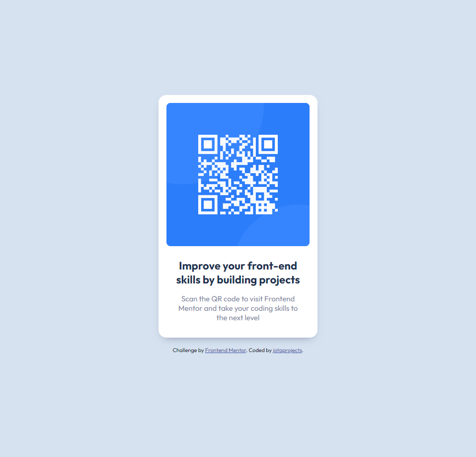

# Frontend Mentor - QR code component solution

This is a solution to the [QR code component challenge on Frontend Mentor](https://www.frontendmentor.io/challenges/qr-code-component-iux_sIO_H). Frontend Mentor challenges help you improve your coding skills by building realistic projects. 

## Table of contents

- [Overview](#overview)
  - [Screenshot](#screenshot)
  - [Links](#links)
- [My process](#my-process)
  - [Built with](#built-with)
  - [Continued development](#continued-development)
  - [Useful resources](#useful-resources)
- [Author](#author)

## Overview

### Screenshot

### Links

- Solution URL: [https://github.com/jotaprojects/qr-code-component](https://github.com/jotaprojects/qr-code-component)

## My process

### Built with

- Semantic HTML5 markup
- Flexbox
- Mobile-first workflow
- BEM naming

### Continued development

- css variables
- center content

### Useful resources

- [Kevin Powell Youtube](https://www.youtube.com/@KevinPowell) - Css tips and tricks.

## Author

- Website - [jotaprojects](https://jotaprojects.se)
- Frontend Mentor - [@jotaprojects](https://www.frontendmentor.io/profile/jotaprojects)
